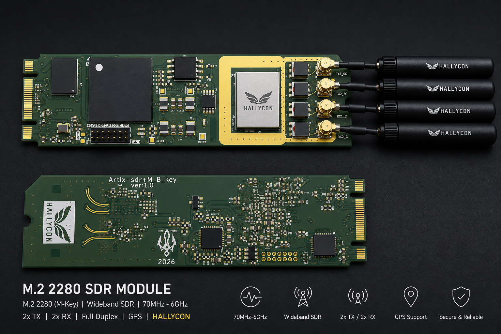

# Spectra SDR

A compact M.2 2280 Software Defined Radio.

<p align="center">
  
</p>

|  |  |
|--|--|
| **FPGA** | Xilinx Artix-7 XC7A50T-2CSG325I |
| **RFIC** | Analog Devices AD9364 (70 MHz -- 6 GHz, 12-bit ADC/DAC) |
| **Host interfaces** | PCIe Gen2 x2, USB 2.0 High-Speed (USB3320 ULPI) |
| **Memory** | 8 MB HyperRAM, 16 MB QSPI Flash |
| **Clock** | 40 MHz TCXO (2.5 ppm) |
| **Form factor** | M.2 2280 (Key B+M) |

---

## The story behind Spectra

This project started with a simple problem: **I needed a 10 Mbps data link
for a UAV, over 1 km, and nothing off the shelf worked.**

I started where most people start — looking for a single chip that could
solve it. The NRF24L01 tops out at 2 Mbps. TI's CC1200 and CC2652 are
great for IoT but nowhere near 10 Mbps range. SX1280 gives you LoRa at
long range, but the throughput isn't there. Every chip I found was either
fast-but-short-range or long-range-but-slow.

So I looked at what the industry actually uses on drones. Herelink — 
proprietary, expensive, locked down. Doodle Labs — military-grade mesh
radios, way out of hobbyist budget. Then I found the open-source side:
OpenHD, OpenIPC — clever projects, but when you dig into their RF layer,
most of them are running hacked Wi-Fi chipsets with privileged register
access, operating outside their intended bands. Fragile, legally grey,
and fundamentally limited by what the Wi-Fi firmware allows.

That sent me down a different rabbit hole. I started reading about OFDM
waveform design, studied the PlutoSDR and Analog Devices' ADALM-PLUTO
implementation, went through the Charon SDR architecture, and found
research papers from projects like Neptune and TruFlight on custom UAV
data links. The conclusion was clear: **if you want a reliable, high-
throughput wireless link with custom waveforms, you need an SDR.** Not
a Wi-Fi chip. Not a LoRa module. A real software-defined radio with an
FPGA and a wideband transceiver.

### The problem with existing SDRs

Once I knew I needed an SDR, I tried to fit one into a UAV stack. It
didn't go well.

**PlutoSDR** — great for learning, but USB-only, limited bandwidth, and
the Zynq 7010 doesn't leave much room for custom DSP after the AD9361
driver takes its share.

**USRP B210** — fantastic radio, but it's the size of a paperback book,
draws 6W, and costs \$1,500. Not something you strap to a 250mm quad.

**LimeSDR Mini** — closer, but the LMS7002M has different trade-offs
than the AD936x family, and the USB 3.0 interface was flaky in my tests.

**BladeRF** — solid board, but again, too large, and I wanted PCIe.

Every board I looked at had the same problem: **they were designed as
bench-top development tools, not as embedded subsystems.** I didn't
need BNC connectors, metal enclosures, and bench power supplies. I needed
something that fits inside a UAV frame, draws minimal power, and connects
directly to a companion computer over PCIe.

And then there was the PCB design problem. I'm not an RF engineer. I
didn't want to route a 6-layer board with impedance-controlled LVDS
pairs and a Zynq BGA from scratch. I needed a simpler path.

### The M.2 idea

The breakthrough was realizing that the M.2 form factor solves almost
every problem at once:

- **22 x 80 mm** — fits inside any drone, any embedded system, any laptop
- **PCIe built in** — Gen2 x2 gives 8 Gbps, enough for full-rate 2x2 MIMO
- **Power from the slot** — 3.3V from the connector, no external supply
- **Available everywhere** — every Raspberry Pi CM4 carrier board, every
  laptop, every mini-ITX motherboard has an M.2 slot

Pair that with the AD9364 (same transceiver as the PlutoSDR and USRP,
70 MHz to 6 GHz, 56 MHz bandwidth, full duplex) on an Artix-7 FPGA,
and you have a serious SDR in the footprint of an NVMe drive.

### Design philosophy

**Small FPGA, on purpose.** The Artix-7 50T has 32,600 LUTs. That's
enough for PCIe DMA, USB streaming, the AD9364 LVDS PHY, 8 MB HyperRAM,
and still leaves 75% of the fabric free for custom DSP — OFDM modulators,
FEC encoders, whatever your application needs. A bigger FPGA means more
cost, more power, and more heat. For a UAV, watts matter. Future variants
(Spectra 100T, Spectra 200T) will scale up the FPGA while keeping the
same pinout, software, and ecosystem.

**Dual interface: PCIe + USB.** Not everyone has an M.2 PCIe slot
available. USB 2.0 HS gives you ~5 MSPS — enough for FM, ADS-B, LoRa,
and narrowband telemetry. PCIe gives you the full 61.44 MSPS. The
SoapySDR plugin auto-detects which is available. Same board, same
bitstream, works everywhere.

**No CPU on the FPGA.** The SoC is CPU-less by design. The host PC (or
Raspberry Pi, or Jetson) is the CPU. The FPGA does what FPGAs do best:
move samples. AD9364 configuration, gain control, and frequency tuning
all happen over the host-side CSR bridge. This keeps the gateware simple,
deterministic, and easy to modify.

**Fully open gateware.** The entire FPGA design is written in Python
using LiteX and Migen. No encrypted IP cores, no vendor lock-in, no
black boxes. The USB stack is built with LUNA/Amaranth. You can read
every register, trace every signal, and modify anything. If you want to
put an OFDM modem on the FPGA, you have the source code for everything
it's connected to.

### Who this is for

- **UAV developers** who need a compact, high-throughput data link
- **Researchers** who want a wideband transceiver they can carry in a backpack
- **Embedded developers** building wireless products on ISM, LTE, or 5G NR bands
- **Students** learning RF, DSP, and FPGA design with real hardware
- **Ham radio operators** who want 70 MHz to 6 GHz in one card
- Anyone who has ever thought "I just want to plug an SDR into my laptop"

### Where this is going

Spectra is not just a board — it is a platform. The hardware and gateware
are here. SoapySDR integration works today with GQRX, SDRangel, CubicSDR,
and GNU Radio. The next step is a Python SDK with ESP32-level simplicity:

```python
from spectra import SDR

sdr = SDR()                   # auto-detect PCIe or USB
sdr.rx.freq = 100e6           # tune to FM band
sdr.rx.gain = 40              # dB
samples = sdr.rx.read(1024)   # get IQ samples
```

And beyond that — a complete OFDM transceiver in the FPGA fabric, so you
can fly a drone with a custom waveform running on a card the size of a
stick of gum. That's the goal. That's why this exists.

---

## Getting started

Your Spectra SDR board comes **pre-flashed** with the v2 bitstream
(`spectra_platform.bit`) that supports both **PCIe and USB** interfaces.
Both paths are fully supported through SoapySDR — the plugin auto-detects
which interface is available. PCIe Gen2 x2 gives full 61.44 MSPS throughput,
USB 2.0 HS gives ~5 MSPS (sufficient for FM, ADS-B, and narrowband work).

If you ever need to re-flash or update the bitstream, download the latest
`spectra_platform.bit` from
[GitHub Releases](https://github.com/iottrends/spectra-sdr/releases)
and flash it via JTAG:

```bash
openFPGALoader -c digilent_hs2 spectra_platform.bit        # volatile (lost on reboot)
openFPGALoader -c digilent_hs2 --write-flash spectra_platform.bin  # persistent via QSPI
```

### Step 1 -- Plug in the board

The Spectra SDR uses an M.2 B+M key, so it fits in both B-key and M-key
slots. Insert it into any M.2 PCIe slot on your Linux host and power on.
The board should enumerate on the PCIe bus immediately.

Verify with `lspci`:

```
$ lspci | grep -i xilinx
03:00.0 Memory controller: Xilinx Corporation Device 7050
```

If you see the Xilinx device, the FPGA is alive and the PCIe link is up.

### Step 2 -- Install the kernel driver

The kernel module gives you `/dev/spectra0` for DMA access.

```bash
git clone https://github.com/iottrends/spectra-sdr.git
cd spectra-sdr
make deps               # fetch required libraries
make driver-install     # build and install spectra.ko
```

After install you should see:

```
$ ls /dev/spectra0
/dev/spectra0
```

The module auto-loads on reboot. To remove it: `sudo make -C software/kernel uninstall`.

### Step 3 -- Run the hardware validation

This is the first thing to run on a new board. The validation script checks
**10 things** in about 2 seconds:

```bash
sudo python3 validate_sdr.py
```

| Step | What it checks |
|------|---------------|
| 1 | Interface detection -- PCIe bus (lspci), driver (/dev/spectra0), USB (lsusb VID:1209 PID:5380) |
| 2 | SoC identification string (confirms bitstream) |
| 3 | FPGA temperature and supply voltages (XADC) |
| 4 | FPGA unique serial number (DNA) |
| 5 | HyperRAM write/read (3 test patterns) |
| 6 | AD9364 SPI ping (product ID register) |
| 7 | AD9364 chip variant + revision |
| 8 | AD9364 SPI bus integrity (scratch register loopback) |
| 9 | LED toggle (look at the board -- both LEDs should blink) |
| 10 | PCIe DMA engine idle check |

If all 10 steps pass and you see the **LEDs blink**, your board is working
and ready for SDR applications.

No PCIe? You can also validate via JTAG:

```bash
# Terminal 1:
litex_server --jtag --jtag-config openocd_xc7_ft2232.cfg
# Terminal 2:
python3 validate_sdr.py --transport jtag
```

### Step 4 -- Install SoapySDR plugin

This step enables all standard SDR applications.

```bash
# Prerequisites
sudo apt install cmake libsoapysdr-dev soapysdr-tools libusb-1.0-0-dev

# Build and install
make soapysdr-install
```

Verify SoapySDR sees your board:

```
$ SoapySDRUtil --find
Found device 0
  device = Spectra SDR
  driver = spectra
  path = /dev/spectra0
  serial = 1234567890abcdef
```

### Step 5 -- Use with SDR applications

The Spectra SDR works with any SoapySDR-compatible application:

| Application | What it does | Install |
|------------|-------------|---------|
| **GQRX** | Spectrum analyzer + receiver | `sudo apt install gqrx-sdr` |
| **SDRangel** | Full TX/RX SDR suite | [sdrangel.org](https://www.sdrangel.org/) |
| **CubicSDR** | Cross-platform spectrum browser | `sudo apt install cubicsdr` |
| **GNU Radio** | Signal processing framework | `sudo apt install gnuradio` |
| **SoapySDR CLI** | Command-line streaming | `SoapySDRUtil --probe` |

Example -- receive FM radio in GQRX:

1. Launch `gqrx`
2. Select **Spectra SDR** from the device list
3. Set frequency to **100 MHz** (FM broadcast band)
4. Set sample rate to **30.72 MSPS**
5. Set RF gain to **40 dB**
6. Click play -- you should see the FM spectrum

---

## What's in this repo

### Gateware (FPGA design)

| File | What it does |
|------|-------------|
| `spectra_platform.py` | FPGA pin map, I/O standards, timing constraints |
| `spectra_target.py` | v1 SoC -- PCIe DMA to AD9364 |
| `spectra_target_v2.py` | v2 SoC -- adds USB 2.0 IQ streaming |
| `usb_iq_device.py` | USB bulk device generator (Amaranth/LUNA) |
| `usb_iq_device.v` | Generated Verilog (regenerate: `python3 usb_iq_device.py`) |

### Host software

| Directory | What it does |
|-----------|-------------|
| `software/kernel/` | Linux kernel module -- creates `/dev/spectra0`, handles PCIe DMA |
| `software/soapysdr/` | SoapySDR plugin -- bridges Spectra to GQRX, SDRangel, GNU Radio |

### Scripts and tools

| Script | What it does |
|--------|-------------|
| `validate_sdr.py` | 10-step hardware validation (power, memory, SPI, LEDs, DMA) |
| `scripts/ad9364_init.py` | Minimal AD9364 initialization -- configures BBPLL, tunes LO, sets gain, enables IQ streaming |
| `setup_deps.sh` | Fetches libraries needed for the SoapySDR build |

### Documentation

| Document | What it covers |
|----------|---------------|
| [Quick Start Guide](docs/quickstart.md) | Full walkthrough: build, flash, validate, stream |
| [v2 Design Reference](docs/spectra_v2_design.md) | SoC architecture, module details, register maps |
| [Clocking & AD9364 Init](docs/clocking_and_ad9364_init.md) | Clock tree, BBPLL configuration, bring-up sequence |
| [Developer Experience Strategy](docs/developer_experience_strategy.md) | SDK roadmap and Python API design |
| [Pin Map Reference](docs/pinmap_reference.md) | FPGA pin assignments and bank voltage reference |
| [Resource Utilization](resource_utilization.md) | FPGA resource usage breakdown |
| [Host Software](software/README.md) | Kernel module and SoapySDR build instructions |

---

## Architecture

```
Host PC
 |
 |-- PCIe Gen2 x2 --> LitePCIe DMA ----+
 |                                      |
 '-- USB 2.0 HS ----> LUNA USB Core ---+
                                        |
                                  Stream CDC FIFOs
                                        |
                                  AD9364 LVDS PHY
                                        |
                                  AD9364 RFIC (RF)
                                  70 MHz -- 6 GHz
```

Three clock domains:
- `sys` -- 125 MHz (logic, DMA, CSR bus)
- `rfic` -- 245.76 MHz (AD9364 DATA_CLK, IQ sample path)
- `usb` -- 60 MHz (USB3320 ULPI interface)

---

## Building from source

Only needed if you want to modify the gateware or rebuild the bitstream.

```bash
# Prerequisites: Vivado 2025.2+, Python 3.8+
python3 -m venv venv && source venv/bin/activate
pip install -r requirements.txt
make deps

# Build
make build          # ~20 min, produces build/spectra_platform/gateware/spectra_platform.bit

# Flash via JTAG
make load

# Flash to QSPI (persistent across reboots)
openFPGALoader -c digilent_hs2 --write-flash build/spectra_platform/gateware/spectra_platform.bin
```

### Make targets

| Target | What it does |
|--------|-------------|
| `make build` | Synthesize bitstream (requires Vivado) |
| `make load` | Load bitstream via JTAG |
| `make validate` | Run hardware validation (PCIe) |
| `make validate-jtag` | Run hardware validation (JTAG) |
| `make driver` | Build kernel module |
| `make driver-install` | Build + install kernel module |
| `make soapysdr` | Build SoapySDR plugin |
| `make soapysdr-install` | Build + install SoapySDR plugin |
| `make usb-verilog` | Regenerate USB Verilog (requires Amaranth + LUNA) |
| `make deps` | Fetch build dependencies |
| `make clean` | Remove all build artifacts |

---

## Troubleshooting

| Symptom | Likely cause | Fix |
|---------|-------------|-----|
| `lspci` shows nothing | Board not seated / PCIe lane issue | Reseat M.2 card, check slot supports PCIe |
| No `/dev/spectra0` | Kernel module not loaded | `sudo insmod software/kernel/spectra.ko` |
| Validation: SPI timeout | AD9364 not powered | Check 2.5V supply on Bank 15 |
| Validation: HyperRAM fail | RAM chip or 1.8V supply issue | Check Bank 34 power rail |
| Validation: DNA reads zero | Bitstream not loaded | Re-flash via JTAG |
| `SoapySDRUtil --find` empty | Plugin not installed or driver missing | Run `make soapysdr-install` and `make driver-install` |
| GQRX: no signal | LO out of range or gain too low | AD9364 range is 70 MHz -- 6 GHz, try gain 50+ |

---

## License

BSD-2-Clause
