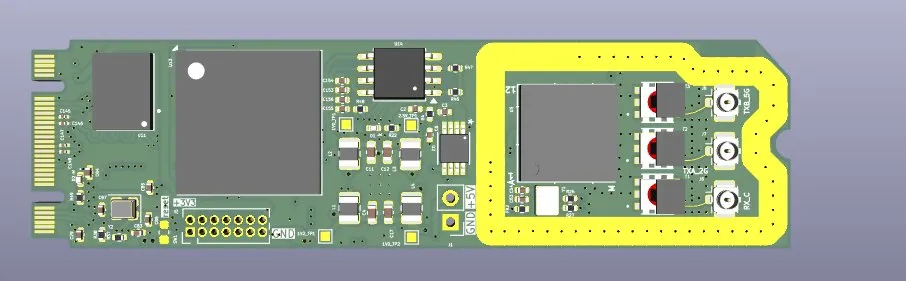
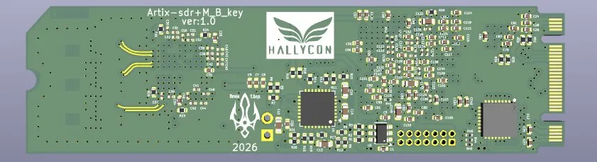

# Spectra SDR

A compact M.2 2280 Software Defined Radio.

<p align="center">
  
  
</p>

|  |  |
|--|--|
| **FPGA** | Xilinx Artix-7 XC7A50T-2CSG325I |
| **RFIC** | Analog Devices AD9364 (70 MHz -- 6 GHz, 12-bit ADC/DAC) |
| **Host interfaces** | PCIe Gen2 x2, USB 2.0 High-Speed (USB3320 ULPI) |
| **Memory** | 8 MB HyperRAM, 16 MB QSPI Flash |
| **Clock** | 40 MHz TCXO (2.5 ppm) |
| **Form factor** | M.2 2280 (Key M) |

---

## Getting started

Your Spectra SDR board comes **pre-flashed** with a bitstream that supports
PCIe IQ streaming out of the box. If you ever need to re-flash or update the
bitstream, grab the latest `.bit` file from
[GitHub Releases](https://github.com/iottrends/spectra-sdr/releases).

### Step 1 -- Plug in the board

Insert the Spectra SDR into any M.2 Key M slot (PCIe) on your Linux host and
power on. The board should enumerate on the PCIe bus immediately.

Verify with `lspci`:

```
$ lspci | grep -i xilinx
03:00.0 Memory controller: Xilinx Corporation Device 7050
```

If you see the Xilinx device, the FPGA is alive and the PCIe link is up.

### Step 2 -- Install the kernel driver

The kernel module gives you `/dev/spectra0` for DMA access.

```bash
git clone https://github.com/iottrends/spectra-sdr.git
cd spectra-sdr
make deps               # fetch required libraries
make driver-install     # build and install spectra.ko
```

After install you should see:

```
$ ls /dev/spectra0
/dev/spectra0
```

The module auto-loads on reboot. To remove it: `sudo make -C software/kernel uninstall`.

### Step 3 -- Run the hardware validation

This is the first thing to run on a new board. The validation script checks
**10 things** in about 2 seconds:

```bash
sudo python3 validate_sdr.py
```

| Step | What it checks |
|------|---------------|
| 1 | PCIe device `/dev/spectra0` exists |
| 2 | SoC identification string (confirms bitstream) |
| 3 | FPGA temperature and supply voltages (XADC) |
| 4 | FPGA unique serial number (DNA) |
| 5 | HyperRAM write/read (3 test patterns) |
| 6 | AD9364 SPI ping (product ID register) |
| 7 | AD9364 chip variant + revision |
| 8 | AD9364 SPI bus integrity (scratch register loopback) |
| 9 | LED toggle (look at the board -- both LEDs should blink) |
| 10 | PCIe DMA engine idle check |

If all 10 steps pass and you see the **LEDs blink**, your board is working
and ready for SDR applications.

No PCIe? You can also validate via JTAG:

```bash
# Terminal 1:
litex_server --jtag --jtag-config openocd_xc7_ft2232.cfg
# Terminal 2:
python3 validate_sdr.py --transport jtag
```

### Step 4 -- Install SoapySDR plugin

This step enables all standard SDR applications.

```bash
# Prerequisites
sudo apt install cmake libsoapysdr-dev soapysdr-tools

# Build and install
make soapysdr-install
```

Verify SoapySDR sees your board:

```
$ SoapySDRUtil --find
Found device 0
  device = Spectra SDR
  driver = spectra
  path = /dev/spectra0
  serial = 1234567890abcdef
```

### Step 5 -- Use with SDR applications

The Spectra SDR works with any SoapySDR-compatible application:

| Application | What it does | Install |
|------------|-------------|---------|
| **GQRX** | Spectrum analyzer + receiver | `sudo apt install gqrx-sdr` |
| **SDRangel** | Full TX/RX SDR suite | [sdrangel.org](https://www.sdrangel.org/) |
| **CubicSDR** | Cross-platform spectrum browser | `sudo apt install cubicsdr` |
| **GNU Radio** | Signal processing framework | `sudo apt install gnuradio` |
| **SoapySDR CLI** | Command-line streaming | `SoapySDRUtil --probe` |

Example -- receive FM radio in GQRX:

1. Launch `gqrx`
2. Select **Spectra SDR** from the device list
3. Set frequency to **100 MHz** (FM broadcast band)
4. Set sample rate to **30.72 MSPS**
5. Set RF gain to **40 dB**
6. Click play -- you should see the FM spectrum

---

## What's in this repo

### Gateware (FPGA design)

| File | What it does |
|------|-------------|
| `spectra_platform.py` | FPGA pin map, I/O standards, timing constraints |
| `spectra_target.py` | v1 SoC -- PCIe DMA to AD9364 |
| `spectra_target_v2.py` | v2 SoC -- adds USB 2.0 IQ streaming |
| `usb_iq_device.py` | USB bulk device generator (Amaranth/LUNA) |
| `usb_iq_device.v` | Generated Verilog (regenerate: `python3 usb_iq_device.py`) |

### Host software

| Directory | What it does |
|-----------|-------------|
| `software/kernel/` | Linux kernel module -- creates `/dev/spectra0`, handles PCIe DMA |
| `software/soapysdr/` | SoapySDR plugin -- bridges Spectra to GQRX, SDRangel, GNU Radio |

### Scripts and tools

| Script | What it does |
|--------|-------------|
| `validate_sdr.py` | 10-step hardware validation (power, memory, SPI, LEDs, DMA) |
| `scripts/ad9364_init.py` | Minimal AD9364 initialization -- configures BBPLL, tunes LO, sets gain, enables IQ streaming |
| `setup_deps.sh` | Fetches libraries needed for the SoapySDR build |

### Documentation

| Document | What it covers |
|----------|---------------|
| [Quick Start Guide](docs/quickstart.md) | Full walkthrough: build, flash, validate, stream |
| [v2 Design Reference](docs/spectra_v2_design.md) | SoC architecture, module details, register maps |
| [Clocking & AD9364 Init](docs/clocking_and_ad9364_init.md) | Clock tree, BBPLL configuration, bring-up sequence |
| [Developer Experience Strategy](docs/developer_experience_strategy.md) | SDK roadmap and Python API design |
| [Pin Map Reference](docs/pinmap_reference.md) | FPGA pin assignments and bank voltage reference |
| [Resource Utilization](resource_utilization.md) | FPGA resource usage breakdown |
| [Host Software](software/README.md) | Kernel module and SoapySDR build instructions |

---

## Architecture

```
Host PC
 |
 |-- PCIe Gen2 x2 --> LitePCIe DMA ----+
 |                                      |
 '-- USB 2.0 HS ----> LUNA USB Core ---+
                                        |
                                  Stream CDC FIFOs
                                        |
                                  AD9364 LVDS PHY
                                        |
                                  AD9364 RFIC (RF)
                                  70 MHz -- 6 GHz
```

Three clock domains:
- `sys` -- 125 MHz (logic, DMA, CSR bus)
- `rfic` -- 245.76 MHz (AD9364 DATA_CLK, IQ sample path)
- `usb` -- 60 MHz (USB3320 ULPI interface)

---

## Building from source

Only needed if you want to modify the gateware or rebuild the bitstream.

```bash
# Prerequisites: Vivado 2025.2+, Python 3.8+
python3 -m venv venv && source venv/bin/activate
pip install -r requirements.txt
make deps

# Build
make build          # ~20 min, produces build/spectra_platform/gateware/spectra_platform.bit

# Flash via JTAG
make load

# Flash to QSPI (persistent across reboots)
openFPGALoader -c digilent_hs2 --write-flash build/spectra_platform/gateware/spectra_platform.bin
```

### Make targets

| Target | What it does |
|--------|-------------|
| `make build` | Synthesize bitstream (requires Vivado) |
| `make load` | Load bitstream via JTAG |
| `make validate` | Run hardware validation (PCIe) |
| `make validate-jtag` | Run hardware validation (JTAG) |
| `make driver` | Build kernel module |
| `make driver-install` | Build + install kernel module |
| `make soapysdr` | Build SoapySDR plugin |
| `make soapysdr-install` | Build + install SoapySDR plugin |
| `make usb-verilog` | Regenerate USB Verilog (requires Amaranth + LUNA) |
| `make deps` | Fetch build dependencies |
| `make clean` | Remove all build artifacts |

---

## Troubleshooting

| Symptom | Likely cause | Fix |
|---------|-------------|-----|
| `lspci` shows nothing | Board not seated / PCIe lane issue | Reseat M.2 card, check slot supports PCIe |
| No `/dev/spectra0` | Kernel module not loaded | `sudo insmod software/kernel/spectra.ko` |
| Validation: SPI timeout | AD9364 not powered | Check 2.5V supply on Bank 15 |
| Validation: HyperRAM fail | RAM chip or 1.8V supply issue | Check Bank 34 power rail |
| Validation: DNA reads zero | Bitstream not loaded | Re-flash via JTAG |
| `SoapySDRUtil --find` empty | Plugin not installed or driver missing | Run `make soapysdr-install` and `make driver-install` |
| GQRX: no signal | LO out of range or gain too low | AD9364 range is 70 MHz -- 6 GHz, try gain 50+ |

---

## License

BSD-2-Clause
