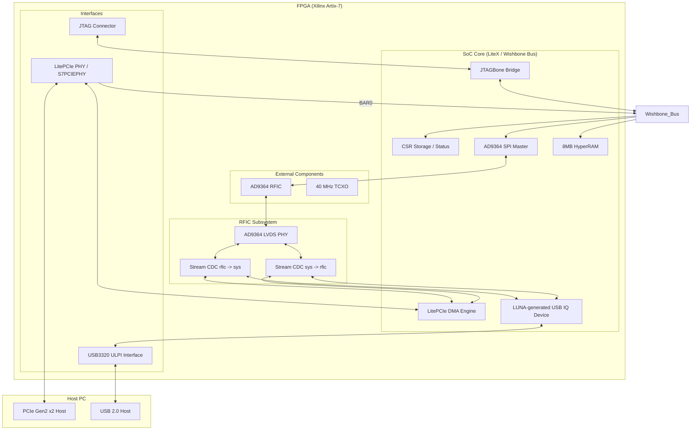

# Hallycon M2 SDR SoC v2 Design Document

## 1. Overview
The **Hallycon M2 SDR v2** is a high-performance Software Defined Radio (SDR) platform based on a CPU-less LiteX SoC architecture. It provides two high-speed host interfaces—**PCIe Gen2 x2** and **USB 2.0 (High-Speed)**—to stream IQ data from an **AD9364 RFIC**.

## 2. Block Diagram

---

## 3. Data Path Architecture

### 3.1 AD9364 IQ Stream
The AD9364 PHY implements a source-synchronous LVDS interface. Data is sampled in the `rfic` clock domain (derived from `DATA_CLK`) and moved to the `sys` clock domain (125 MHz) via **Stream CDC FIFOs**.

### 3.2 PCIe DMA Path
- **Interface**: PCIe Gen2 x2 (approx. 8 Gbps theoretical).
- **Engine**: `LitePCIeDMA` with 8192-deep buffering.
- **Connection**: Directly wired to the AD9364 stream.
- **Interrupts**: MSI-based interrupts notify the host driver of buffer completion.

### 3.3 USB IQ Path
- **Interface**: USB 2.0 High-Speed (480 Mbps).
- **Core**: LUNA-generated `usb_iq_device.v`.
- **Endpoints**:
    - **EP1 IN**: Transmits IQ data from FPGA to PC.
    - **EP2 OUT**: Receives IQ data from PC to FPGA.
- **Dedicated FIFOs**:
    - **Hardware Level**: `usb_iq_device.v` contains internal packet buffers for ULPI synchronization.
    - **SoC Level**: `usb_rx_cdc` and `usb_tx_cdc` act as asynchronous dual-port RAM FIFOs between the 125 MHz `sys` domain and the 60 MHz `usb` domain.

---

## 4. Control Path & SPI Management

### 4.1 SPI Control via PCIe
The primary control path is through the **PCIe BAR0**. The host PC maps the FPGA's CSR space into its memory. Writing to the `ad9364_spi` CSRs triggers the `AD9364SPIMaster` state machine to send/receive SPI commands to the RFIC.

### 4.2 SPI Control via USB (Current Implementation)
Currently, the USB core is a **pure data-pipe**. 
- It implements **Data Endpoints** (EP1/EP2) but does **not** yet implement a **Control Endpoint (EP0 Vendor Requests)** or a **Wishbone Master**.
- **To enable SPI via USB**: The `usb_iq_device` would need to be updated with a LUNA "Wishbone Bridge" module to allow the USB host to write to the SoC's Wishbone bus.

### 4.3 SPI Control via JTAG
The `JTAGBone` bridge allows low-level register access using a JTAG cable. This is used for initial board bring-up and debugging when PCIe/USB drivers are not yet loaded.

---

## 5. Clocking & Power
- **TCXO**: 40 MHz reference for the main PLL.
- **sys_clk**: 125 MHz (Logic & DMA).
- **idelay_clk**: 200 MHz (For LVDS delay calibration).
- **usb_clk**: 60 MHz (Derived from USB3320 ULPI clock).
- **rfic_clk**: Variable (Derived from AD9364 `DATA_CLK`).

## 6. Known Limitations
1. **USB-to-Wishbone Bridge**: Missing in the current gateware. USB host cannot configure AD9364 registers directly.
2. **Stream Muxing**: The software must currently choose between PCIe and USB by enabling/disabling the respective engine; there is no hardware-level arbiter in `v2.py`.
